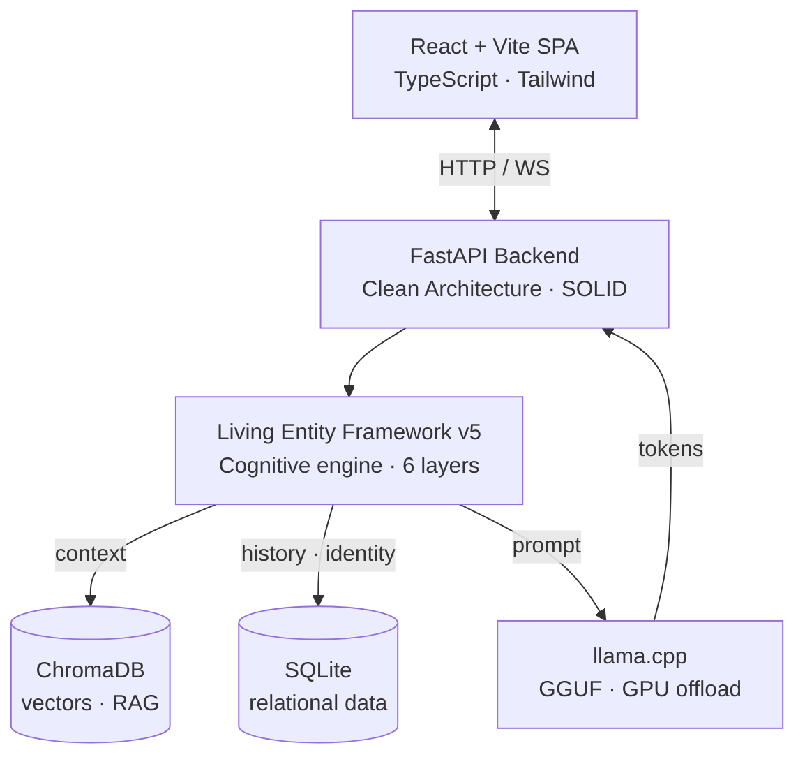

🌐 **English** · [Português (Brasil)](README.pt-BR.md)

# Fellype Samuel dos Santos de Melo
### Software Engineer & Tech Lead — Software Architecture · Applied AI

  
  
  
  
  
  

  
  
  

📍 Rio de Janeiro, RJ, Brazil

---

### 🧠 About Me
Software Engineer and final-semester student of **Systems Analysis and Development (FAETERJ-Rio)**. I work at the intersection of **backend architecture** and **applied Artificial Intelligence** (Deep Learning, NLP, and Computer Vision). As a Tech Lead, I translate business requirements into decoupled architectures and drive technical integrations end to end.

> *"Great software starts by understanding problems before writing code."*

---

## 🤖 Flagship Project — OpenChatBot

**Local-first** engine for agents and characters with **persistent state and memory** — believable behavior applicable to companions, interactive fiction, and **game NPCs**. Runs 100% locally, with RAG and full privacy control, no cloud dependency.

At its core is the **Living Entity Framework v5**, a six-layer cognitive engine (master prompts, identity, social dynamics, emotional state, RAG-based context, and conversation history) built on a **Clean Architecture / SOLID** foundation.

*(Architecture and implementation details below are drawn from the project's own repository — see the link at the end of this section for the current source of truth.)*

**Demo — persistent memory across turns** *(interface walkthrough)*

**Technical highlights**
- Local inference via **llama.cpp** with **GGUF** quantization and GPU offload.
- Hybrid memory: **SQLite** (relational) + **ChromaDB** (vector / RAG).
- Separation of domain, infrastructure, adapters, and presentation layers (Clean Architecture).
- Automated multi-process deployment (frontend build + AI services + Uvicorn).

**Stack** &nbsp; `TypeScript` `React` `Vite` `Python` `FastAPI` `ChromaDB` `llama.cpp`

📂 **[Repository & Documentation →](https://github.com/FellypeMelo/Open-ChatBot)**

---

## ⚡ TurboQuant — Inference Optimization *(llama.cpp fork)*

**2–4 bit KV-cache quantization** with **Walsh–Hadamard rotation** (outlier smoothing before quantizing) for **Intel Arc / Xe2** GPUs via the **SYCL** backend — the same `turbo3` path that powers OpenChatBot.

**As reported in the repository's own benchmarks** *(Intel Arc B580 · Qwen3-4B Q4_K_M · 64k context)*:
- 🔻 KV-cache reduced from **9.2 GB to 1.6–1.8 GB** — up to **7.5x less** memory than fp16
- ⚡ Prefill at **fp16 speed parity**
- 🐛 6 correctness bugs fixed during implementation

**Stack** &nbsp; `C/C++` `SYCL` `Intel oneAPI` `Quantization` `llama.cpp`

📂 **[Fork & technical deep-dive →](https://github.com/FellypeMelo/llama-cpp-turboquant-SYCL)**

---

## 🚀 Other Projects

| Project | What it solves | Stack | Access |
| :--- | :--- | :--- | :--- |
| 🔬 **OpenScientific-Workbench** | Agentic workbench for computational biology: sandboxed multi-agent pipelines and scientific database integration via MCP. | `Python` · `FastAPI` · `Neo4j` · `MCP` | [Repo](https://github.com/FellypeMelo/OpenScientific-Workbench) |
| 👁️ **LocalVision-Jules** | 100% local vision assistant (LLaVA models): image analysis with contextual history and an accessible GUI. | `Python` · `LM Studio` · `LLaVA` | [Repo](https://github.com/FellypeMelo/LocalVision-Jules) |
| 🧬 **Embryo Classification** | **ResNet-18** network (k-fold validation) integrated with a REST API to support an external master's research project. | `PyTorch` · `FastAPI` · `React` | FuzzyLab · private |
| 🦠 **_Trypanosoma cruzi_ Segmentation** | **YOLOv8-seg** fine-tuning to segment structures in scanning electron microscopy images. | `YOLOv8-seg` · `OpenCV` | FuzzyLab · private |
| 🎓 **Educa** | School management system (classes, grades, content) — full-stack capstone project (TCC), with requirements engineering and relational modeling. | `React` · `FastAPI` · `MySQL` | Private (capstone project) |

*Rows marked "private" refer to repositories not publicly available; descriptions above summarize my role, not independently verifiable claims about the private codebases themselves.*

---

### 📝 Research & Publication
**First author** — peer-reviewed academic journal:

> **MELO, F. S. S.** et al. *Arquitetura Algorítmica para Atenção Sustentável: o Modelo Be-Productive como Resposta à Sobrecarga Cognitiva no Capitalismo de Vigilância*. Revista Tópicos, 2026.
> 🔗 **DOI:** [10.70773/revistatopicos/781363235](https://doi.org/10.70773/revistatopicos/781363235)

---

### 🔭 Current Focus
- [ ] Decentralized local multi-agent orchestration at the core of OpenChatBot.
- [ ] Hands-on distributed systems design — Event-Driven Architecture, CQRS, Apache Kafka.
- [ ] Real-time computer vision deployment via WebSockets.

---

### 🛠️ Tech Stack

**Languages**

  
  
  
  
  
  

**Backend & Web**

  
  
  
  

**AI & Data**

  
  
  
  
  
  
  

**Engineering** &nbsp; `Clean Architecture` · `SOLID` · `DDD` · `Design Patterns` · `TDD` · `XP`

---

### 🎓 Education & Certifications
- **Systems Analysis and Development** — *FAETERJ-Rio* (final semester)
- 🛡️ **Ethical Hacking & Network Defense** — Cisco Networking Academy
- 🧠 **AI Fundamentals & Artificial Intelligence** (NLP, Watson Studio) — Cisco & IBM SkillsBuild
- ☕ **Java Foundations** — Oracle Academy

---

### 📊 GitHub

  
  
  

---

  <a href="https://linkedin.com/in/fellype-samuel">LinkedIn</a> ·
  <a href="mailto:fellypesamuel1@hotmail.com">Email</a> ·
  <a href="https://orcid.org/0009-0000-3274-0343">ORCID</a> ·
  <a href="https://github.com/FellypeMelo">GitHub</a>

<i>Open to collaborating on software engineering, applied AI, and open-source projects.</i>

