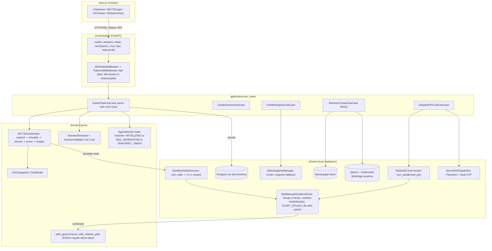
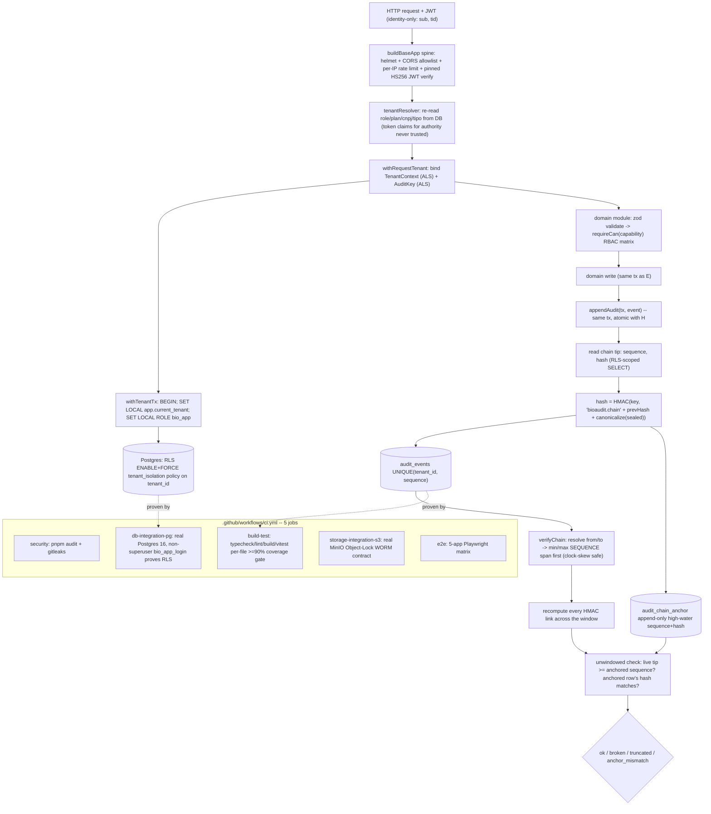
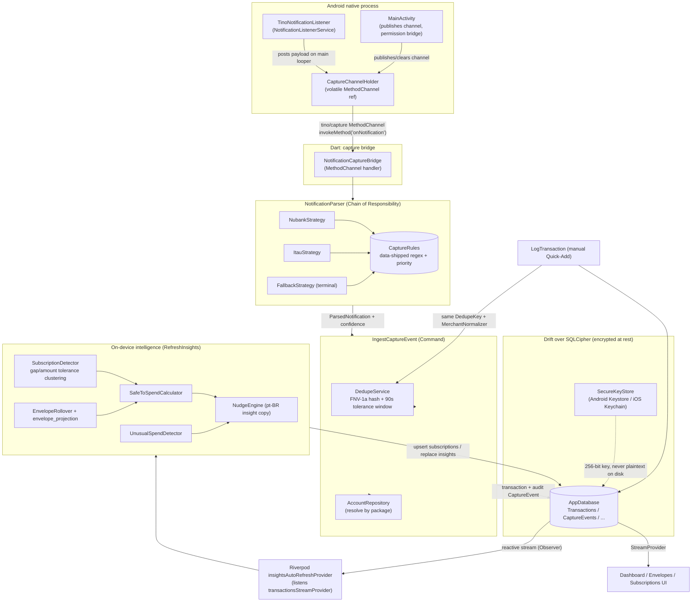
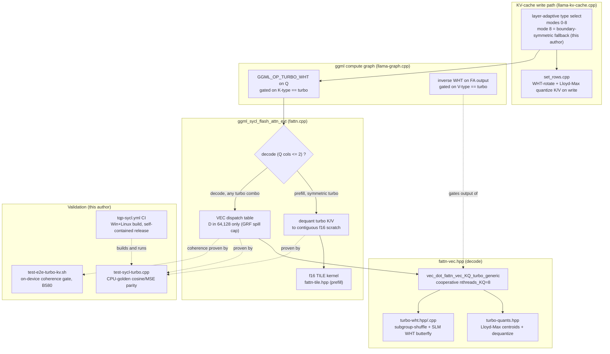

🌐 **English** · [Português (Brasil)](README.pt-BR.md)

# Fellype Samuel dos Santos de Melo
### Software Engineer & Tech Lead — Software Architecture · Applied AI

  
  
  
  
  
  

  
  
  

📍 Rio de Janeiro, RJ, Brazil

---

### 🧠 About Me
Software Engineer and final-semester student of **Systems Analysis and Development (FAETERJ-Rio)**. I work at the intersection of **backend architecture** and **applied Artificial Intelligence** (Deep Learning, NLP, and GPU inference), usually alone, end to end: domain modeling, infrastructure, and the CI that gates both.

> *"Great software starts by understanding problems before writing code."*

---

## 🗂️ Selected Work

Nine repositories went through a real technical review before this section was written — architecture, test suites, commit history, benchmark files. Six are detailed below, ordered by technical depth rather than by visibility: the two most substantial, **OpenScientific-Workbench** and **bio-saas**, are one public and one private. Four private projects appear here because the engineering is the point and I own the code; each private section covers architecture, algorithms, and testing strategy only — no credentials, schemas, tenant/patient data, or business terms. Three more projects that didn't need a full write-up are summarized in a table further down.

---

### 🔬 OpenScientific-Workbench — public

**A Clean-Architecture research-agent platform where LLM-generated bioinformatics code actually runs, inside a real OS sandbox, gated by a DAG scheduler and a numeric-correctness review loop.**

Letting an LLM plan a multi-step bioinformatics workflow and then execute the code it writes has two failure modes that stay invisible in a demo: the generated Python/R/bash has to be contained so it can't read the host filesystem or reach the network, and the agent has to be stopped from confidently returning a wrong number. Both only surface later, as a CVE or a retracted result.

**How it was solved.** Untrusted execution is isolated with **bubblewrap (bwrap)**, not a container runtime: `BubblewrapSandboxDriver` builds a fixed argv that read-only binds `/usr /bin /sbin /lib /lib64 /etc` plus a dedicated micromamba toolkit kept off the app's own venv/PATH, read-write binds only the caller's per-session workspace, mounts an isolated tmpfs, and adds `--unshare-net --unshare-pid --unshare-uts --unshare-ipc --die-with-parent`; CPU-time and address-space caps are applied via `RLIMIT_CPU`/`RLIMIT_AS` in a `preexec_fn` before exec. Every other adapter in the codebase (Neo4j, Vault, Slurm) falls back to a mock when unconfigured — this is the one driver that deliberately refuses to: it raises `SandboxUnavailableError` and won't run unsandboxed code if bwrap is missing. An earlier version of the path-traversal guard only checked `..` and a POSIX leading slash, missing Windows drive-letter absolute paths like `C:\Windows` — live on the project's own Windows dev box (documented in the module as a CWE-22 fix). It now checks `posixpath.isabs`, `ntpath.isabs`, and a drive-letter regex together. On top of execution sits an orchestrator that walks a DAG's topological front, maps each node's real process exit code to a +1/-1 reward, prunes failed nodes and propagates the prune to every dependent, and stops when a token budget runs out — a single-pass greedy scheduler, not a full tree search despite its class name. Because an exit code can't catch a script that runs cleanly but returns a subtly wrong number, a second, independent gate wraps it: a `NumericReviewer` compares nested float/dict/list structures at `1e-5` tolerance, and a rejected run retries (bounded) before an approved one is hashed against the backend's own lockfile for reproducibility.

**Also solved:**
- **172 registered tools, honestly tiered.** Rather than present every tool as equally trustworthy, each is graded A (deterministic library call) through D (registered but always raises `NotSupportedError` — needs infrastructure this single-server deployment doesn't have), documented in `docs/tools/UNSUPPORTED.md`.
- **Local and HPC jobs run through the identical sandboxed path.** `LocalJobDispatcher` (Redis/RQ) and `SlurmSSHDispatcher` (Paramiko + `sbatch`) both pipe their compiled script through the same `BubblewrapSandboxDriver`, so switching backends never opens a second, unsandboxed execution path.

**Results.** 92 commits by a single author over roughly three weeks (2026-07-01 to 2026-07-23); 134 backend source files / 24,747 lines against 105 test files / 19,504 lines (~0.79 test:src ratio); CI gates an 80% coverage threshold plus a dedicated job that installs real bubblewrap on `ubuntu-latest` to run actual escape-attempt payloads — the project's own CI comments flag those specific assertions as unconfirmed from the Windows authoring machine, pending a real Linux runner.

**Stack** &nbsp; `Python 3.12` `FastAPI` `SQLAlchemy (async)` `bubblewrap` `Redis/RQ` `Qdrant + FastEmbed` `Neo4j` `Paramiko + Vault` `Next.js/React` `igv.js` `Mol*` `pytest` `ruff` `mypy`

📂 **[Repository →](https://github.com/FellypeMelo/OpenScientific-Workbench)**

---

### 🏥 bio-saas — private

**Private repository.** The description below covers architecture, algorithms, and testing strategy only — no schemas, secrets, tenant data, or commercial terms.

**A pnpm monorepo of 5 Brazilian healthcare-compliance micro-SaaS apps, sharing a hardened package spine, whose audit trail is provably tamper-evident against a privileged attacker — a DBA, or someone who restores a database dump and edits rows directly.**

Brazilian health and aesthetics clinics face several regulatory deadlines that all demand the same underlying guarantee: an auditable record that survives not just an outside attacker but an inside one. A plain hash chain doesn't get you there — a DBA who can rewrite rows can also recompute a chain over the edited ones — and even a *correct* hash chain replayed over a shortened prefix still verifies cleanly, hiding a deleted tail.

**How it was solved.** Every audit event is sealed and chained with `hash = HMAC-SHA256(serverKey, 'bioaudit.chain\0' + prevHash + '\0' + canonicalize(event))` — a keyed link a row-editing attacker can't forge without the server-held secret, unlike a bare SHA-256 chain. A `UNIQUE(tenant_id, sequence)` constraint makes the chain provably unforkable under concurrency. Because a valid HMAC chain over a *shorter* prefix still verifies, a second, independent append-only `audit_chain_anchor` table records the high-water sequence and tip hash in the same transaction as each append; verification compares the live tip against this anchor to catch truncation. Verification also resolves any date-range query to a sequence span **before** selecting rows — sequence is monotonic and gapless, wall-clock time isn't — so a timestamp-based window can't misreport a false break under clock skew. Tenant isolation is a second, independent layer: a transaction wrapper opens with `SET LOCAL app.current_tenant` + `SET LOCAL ROLE bio_app`, and Postgres Row-Level Security (`ENABLE + FORCE`) restricts every query to the current tenant at the database level, not just in application code. The fast local/test database (Postgres compiled to WASM, in-process) connects as a superuser and therefore can't exercise or disprove RLS — so a dedicated CI job boots a real Postgres 16, authenticates as a genuine non-superuser login role, and asserts cross-tenant reads are denied and forged-tenant inserts are rejected there, where the guarantee can actually fail.

**Also solved:**
- **SSRF on a tenant-supplied webhook URL**, including the DNS-rebinding TOCTOU window between validation and connection — closed with a dependency-free IPv4/IPv6 range classifier (loopback, RFC1918, CGNAT, ULA, link-local, the cloud-metadata address) applied both at config-write time and at actual connect time, via a custom DNS-resolution hook that re-validates the address the socket is about to use.
- **Refresh-token rotation under concurrent requests**, including stolen-token reuse detection — a row lock on the token's id serializes concurrent attempts, a conditional single-use update's affected-row-count is the sole authority on whether the token was already consumed, and a detected reuse revokes every other active token for that user in the same transaction.

**Results.** Running the test suite directly reproduces 22 of 23 test files with 265 of 277 tests passing locally and 12 skipped — exactly the real-Postgres and real-S3 legs gated on live infrastructure not present locally. CI runs those two files for real, against a Postgres 16 and a MinIO service container, as part of a 5-job pipeline: dependency/secret scanning, a per-file ≥90% coverage gate on typecheck/lint/build/test, the real-Postgres RLS proof, the real-S3 WORM proof, and a 5-app Playwright matrix.

**Stack** &nbsp; `TypeScript (strict)` `Node 22 / ESM` `Fastify 5` `Drizzle ORM` `PostgreSQL 16 (RLS)` `argon2` `AWS S3 Object-Lock / MinIO` `zod` `React (PWA)` `Vitest` `Playwright` `pnpm workspaces`

---

### 📱 tino — private

**Private repository.** The description below covers architecture, algorithms, and testing strategy only — no product roadmap, real notification content, or personal data.

**A local-first Flutter finance tracker that reads Brazilian bank/Pix push notifications straight off the phone and turns them into structured transactions on-device — no bank login, no server.**

Brazilian personal-finance apps either require fragile bank-login sync or force manual entry that people abandon. Tino's approach needs a genuinely hard extraction step — bank notification copy varies by institution, changes without warning, and carries ambiguous Brazilian-Portuguese number formatting — while guaranteeing no purchase is ever double-counted across two independent entry paths (silent capture and manual quick-add), and then deriving budget/subscription intelligence from that self-reported ledger with nothing external to check it against.

**How it was solved.** A native Kotlin `NotificationListenerService` observes posted notifications system-wide (once the user grants OS-level consent) and forwards title, body, and post-time to Dart over a method channel. There, a **Chain of Responsibility** of per-institution strategies (keyed by package name) delegates actual field extraction to `CaptureRule` objects — regex patterns shipped as *data* with a priority, not compiled into the app, so a new bank template or a fix ships without a rebuild. Each rule scores a confidence (1.0 full match, 0.7 amount-only, −0.2 for multi-value ambiguity), and a small `parseBrAmount()` function disambiguates `1.234,56` vs `12.34` vs `1.234` using Brazilian-Portuguese grouping conventions. An `IngestCaptureEvent` use case resolves the destination account, computes an FNV-1a 64-bit dedupe hash over account + amount + normalized merchant + minute-truncated time, layers a 90-second tolerance window for near-boundary duplicates, and writes into a SQLCipher-encrypted database whose key lives only in the Android Keystore / iOS Keychain. A separate, purely on-device intelligence layer reruns on every ledger mutation: subscription detection clusters debits by merchant using gap/amount tolerance bands, and a safe-to-spend calculator and envelope rollover derive a transparent daily budget from arithmetic over the same transactions — no external data source, no black box.

**Two shipped bugs, found and fixed on purpose:**
- Silent Capture and manual Quick-Add originally normalized merchant names differently, so one real merchant split into two subscription groups and a manual entry of an already-captured purchase double-counted it. Fixed by extracting one shared normalizer used by both paths, checking for an existing dedupe hash before insert, and wiring the previously-dead tolerance-window check into the ingestion path — closing a real 12:00:59-vs-12:01:03 boundary case an exact-hash bucket alone would miss.
- Subscription detection originally minted a fresh random id on every recompute, so re-running it (which happens on every ledger mutation) piled up duplicate rows without bound. Fixed with a deterministic merchant-derived id, a unique index, and a real schema migration that clears legacy duplicate rows before the index can be built — verified by hand-constructing a raw legacy SQLite database and asserting the ledger survives untouched through the upgrade.

**Results.** 33 test files, 180 `test()` cases plus 7 widget tests (187 total, counted directly from the test tree) — no coverage percentage is claimed since CI uploads a coverage artifact but doesn't gate on a threshold. Both fixed defects above are pinned down by a named regression test each, not just fixed silently. CI gates generated-code freshness, a formatting check, static analysis, and the full test suite before merge.

**Stack** &nbsp; `Flutter/Dart` `Kotlin (native listener)` `Riverpod` `Drift + SQLCipher` `flutter_secure_storage` `fpdart` `GitHub Actions`

---

### 📒 fecho — private

**Private repository.** The description below covers architecture, algorithms, and testing strategy only. This dossier's own review found no benchmark, coverage, or test-count figures suitable for citing here — so unlike the other sections, no numbers appear below; the engineering is described on its own terms.

**A local-first Flutter cash-book for Brazilian micro-entrepreneurs (MEI) that turns a 60-second daily close into a real double-entry ledger.**

The daily ritual — what sold, what didn't, cash count — has to become a ledger a Brazilian accountant would actually accept: it must trial-balance to exactly R$0,00 every time, must never duplicate a day's revenue if the app dies mid-write, and must apply different tax treatment depending on whether the business is a MEI (fixed monthly tax, hard annual revenue ceiling) or a small-business (Simples Nacional ME) regime — entirely offline, encrypted at rest.

**How it was solved.** Money is a value object wrapping an arbitrary-precision decimal type — floating point is explicitly rejected in the class's own doc comment, because a ledger "must reconcile to exactly zero." Posting each day's close is a **Strategy**: a factory picks a MEI poster or a Simples-ME poster, both extending a base class that emits the shared entries (sales by payment method, cash movements, waste write-offs) and deferring to a template-method hook for regime-specific lines — only the Simples poster overrides it, to accrue the tax entry at the resolved effective rate. Every batch then passes through a balance validator that doesn't just check that total debits equal total credits (a symmetric bug could satisfy that while still crediting the wrong account) — it builds a full per-account trial-balance map across the batch and requires *every account's* net movement to be exactly zero, with no epsilon. The whole write — sale lines, cash movements, journal entries, and the close header, across four separate tables — goes through a Unit of Work: a functional-style failure inside the transaction callback is converted to a thrown exception so the database's own transaction rollback undoes the partial write, then translated back into the code's ordinary "failures are values, not exceptions" contract on the way out. If the platform keystore ever invalidates the stored encryption key (for example after a biometric/security reset), the app treats the now-permanently-undecryptable database as unrecoverable, wipes it and generates a fresh key — trading data loss for a working app instead of a boot-crash loop.

**Also solved:**
- **Six schema migrations without ever risking a crash on real user data.** One migration added a uniqueness constraint to make double-closing a day structurally impossible at the SQL level — which required first de-duplicating any pre-existing duplicate close rows (and their dependent journal entries) or the migration itself would fail the constraint it was adding. This is verified by starting from a generated legacy schema snapshot, inserting two duplicate closes via raw SQL, migrating forward, and asserting exactly the later one survives.
- **Prorating the annual revenue ceiling correctly** for a business registered partway through the year, while capping the run-rate exhaustion forecast so a near-zero revenue day can't produce a multi-decade projection instead of a sane "no forecast."

**Stack** &nbsp; `Flutter/Dart` `Drift` `SQLCipher` `flutter_secure_storage` `package:decimal` `fpdart` `freezed` `Riverpod` `GitHub Actions`

---

### ⚡ llama-cpp-turboquant-SYCL — public fork, not merged upstream

**A port of an existing KV-cache compression scheme to Intel's SYCL backend for Arc GPUs — not the invention of the scheme itself.**

This is a fork of [`TheTom/llama-cpp-turboquant`](https://github.com/TheTom/llama-cpp-turboquant), which is itself a fork of [`ggml-org/llama.cpp`](https://github.com/ggml-org/llama.cpp) (10,185 commits at the merge-base). **TurboQuant** — a Walsh-Hadamard rotation followed by Lloyd-Max codebook quantization of the KV-cache, invented and implemented for Metal and CUDA by TheTom and Gabe Ortiz, with contributions from Sean, Tuklus-Labs, Simon Gardling and Nathan Maine — is not my work. What I wrote, verified directly with `git log --author` against this fork, is roughly 30 commits: the port of that scheme to Intel's SYCL backend, the rotation kernels for that backend, an asymmetric-precision flash-attention dispatcher, and the parity-test and CI harness that validated the port on physical hardware. There is no upstream pull request or merge into `ggml-org/llama.cpp` — this is a personal release artifact, not an accepted contribution.

**The problem the port had to solve.** On a 12GB Intel Arc B580, the KV cache — not the model weights — is the memory wall for long-context inference (fp16 KV at 64k context runs close to 9.2GB, near-OOM). TurboQuant already compressed that to 2–4 bits/value on CUDA and Metal, but none of that carries over to SYCL: Intel's GPU has a different subgroup/register model than CUDA's warps, a different flash-attention implementation to hook into, and every numeric claim had to be re-proven on real Arc silicon from zero.

**How the port was done.** The rotation kernel does its butterfly stages via `sycl::select_from_group` subgroup shuffles while the step size is smaller than the hardware subgroup, then switches to a shared-local-memory, barrier-synchronized butterfly once the step crosses that boundary — a two-regime kernel with no direct CUDA equivalent, since SYCL subgroups and CUDA warps don't line up one-to-one. Flash-attention dispatch is a macro grid instantiating a decode-oriented or a prefill-oriented kernel per (head-dim, K-type, V-type); turbo rows are capped at head-dim 64/128 because Intel's large-register-file mode caps around 128 registers/thread versus CUDA's 255 — the full pre-rotated query vector spills at 256. Rotation state is threaded through the compute graph as gated operations (query rotated in, output inverse-rotated out, both gated on the cache's data type) rather than reapplied in the hot loop — which is what lets an asymmetric precise-key/compressed-value pair work with no graph changes at all.

**A debugging story worth including on its own merits.** One commit rewrote the decode kernel to a cooperative slice pattern on the hypothesis that a register-occupancy limit was causing an observed 3.4x decode-at-depth slowdown — then measured that a standard 8-bit quantized cache collapses by a comparable amount at the same depth (the compressed cache actually edges it out). That disproved the hypothesis: the regression turned out to be inherent to per-element dequantization in any quantized-KV decode loop, not a defect specific to this scheme. The refactor was kept as a register-headroom improvement, not presented as a fix for something it didn't fix. A related bug was a pre-existing layer-adaptive policy that put two boundary layers into a combination the dispatch table had no case for, producing a crash on model warmup; the fix that followed produced flaky, non-deterministic output at 2-bit precision on those same boundary layers, root-caused to floating-point reduction with no quantization headroom, and finally resolved with a symmetric fallback mode so boundary layers only ever exercise the two independently-proven paths.

**Validation, deliberately in three independent layers**, because kernel-level parity and model-level coherence are different failure modes: a CPU-golden numeric parity test comparing against the CUDA/Metal authors' own reference quantizers (cosine similarity and MSE), an on-device coherence gate that runs real text generation on the physical GPU and rejects keyword mismatch, corruption, 5-gram repetition, or low lexical diversity, and a perplexity/speed quality gate. A prior version of the test suite only asserted "output is finite" — which had hidden real bugs (double rotation, a misread value in the cache).

**Results, all from the repository's own benchmark files.** The compressed formats run 2.125 / 3.125 / 4.25 bits/value against fp16's 16 — 7.53x / 5.12x / 3.76x smaller. On Arc B580 with a Qwen3-4B model, enabling one build configuration moved prefill from 1246.70 to 2528.80 tok/s (+102.8%) with decode within error bars of baseline (−3.3%); real end-to-end generation with the compressed cache ran at 74.8 tok/s against an fp16 baseline of 77.4 tok/s (−3.4%) and produced coherent text, while the same configuration without the boundary-layer fix degenerated into repeated loops. A documented, non-hidden regression: the compressed cache's decode is roughly 3.4x slower than fp16 at 32k context depth — but standard 8-bit quantization collapses by a comparable proportion at the same depth, so the comparison that matters is against other quantized caches, not against fp16.

**Stack** &nbsp; `C++` `SYCL / DPC++ (Intel oneAPI)` `CMake + Ninja` `ggml/llama.cpp compute graph` `Intel Arc B580 (Xe2)` `GitHub Actions (Windows + Linux CI)`

📂 **[Fork →](https://github.com/FellypeMelo/llama-cpp-turboquant-SYCL)**

---

### 🤖 Open-ChatBot — public

**A local-first, self-hosted LLM roleplay-character engine: a token-budgeted prompt assembler, an optimistic-concurrency persona state machine, and a crash-safe quantized memory store.**

Run against a small local model with a narrow context window that attends poorly to its middle, naive chat-history concatenation either overflows the window or drowns the character's persona in noise. On top of that, one character can hold many concurrent chat branches — edits, regenerates, a background reflection process — so a shared, mutable persona has to stay consistent across concurrent writers while each branch's own memory stays walled off from its siblings. A historical bug in this exact repository, reproduced by a named regression test, shows the failure mode concretely: unthresholded memory retrieval plus a clear-chat path that never touched the vector store let hallucinated content resurface turns later.

**How it was solved.** Prompt assembly is budgeted against the model's *real* tokenizer — a calculator posts to the local inference server's tokenize endpoint for exact counts, holds a fixed-cap allocation table per prompt layer kept in sync with what the template actually emits, floors chat history to a minimum share of the budget so it never starves to zero, and runs a final non-blocking check on the fully assembled prompt as a last-resort overflow log. The assembled stack restates a compact persona-and-scene summary immediately before the generation cue, deliberately exploiting a small model's attention bias toward the start and end of its context. Persona state uses SQLAlchemy's optimistic-locking version column, taken under a row lock and wrapped in bounded retry loops at every write path; each retry re-derives fresh state and manually re-applies whatever domain mutation the rollback discarded, since a plain re-commit would silently drop it. A database-level uniqueness constraint on message branch/variant backstops the same race for concurrent regenerate/stream inserts. The persistent persona mirrors whichever chat is currently active for conversation-local fields — the codebase's own internal documentation calls this the most bug-prone area in the system — and a background reflection task is mirror-aware, so a slow asynchronous call can't bleed one storyline's relationship delta into another if the user switches chats mid-reflection. Long-term memory is a 4-bit quantized vector store (the same TurboQuant family as the SYCL fork above) scoped per character-and-chat on every read and write; retrieval over-fetches, drops results under a similarity floor, re-ranks by similarity blended with recency, and greedily drops near-duplicate results so paraphrases don't crowd out the top results. Persistence uses a custom atomic dump — the store's multi-file format is written to a sibling temp directory first, then each file is promoted with an atomic rename, eliminating torn writes on crash.

**Results.** 236 commits by a single author across roughly 2.5 months (2026-05-07 to 2026-07-25); 45 backend test files, 10,117 lines, 304 test functions, including dedicated anti-poisoning and cross-chat-scoping regression suites; CI gates an 80% coverage threshold on both Linux and Windows runners — the Windows leg exists specifically because an earlier Windows-only bug had slipped past a Linux-only matrix, per the workflow's own comment.

**Demo — persistent memory across turns** *(interface walkthrough)*

**Stack** &nbsp; `FastAPI` `SQLAlchemy + Alembic + SQLite` `httpx` `LangChain (OpenAI-compatible client)` `llama.cpp / llama-server` (running its own `turbo3` KV-cache quantization from the SYCL fork above) `4-bit quantized vector store` `React 19 + TypeScript + Vite` `Vitest + Playwright`

📂 **[Repository →](https://github.com/FellypeMelo/Open-ChatBot)**

---

## 🚀 More Work

Three more projects went through the same review and held up well, without needing a full write-up here.

| Project | What it is | Key mechanism | Stack | Access |
| :--- | :--- | :--- | :--- | :--- |
| **StoryForge** | Offline-first desktop app for AI-assisted novel writing | `sqlite-vec` semantic search over story lore that survives live embedding-dimension changes; a 6-provider LLM router behind a circuit breaker; validated against a live (non-mocked) `llama.cpp` server that caught real model-output drift a test double had been hiding | Rust/Tauri, React/TS, SQLite + sqlite-vec, llama.cpp | [Repo](https://github.com/FellypeMelo/StoryForge) |
| **embryo_trainer** | DDD-refactored PyTorch/YOLO pipeline for IVF embryo classification and blastocyst grading | Diagnosed a group-wise data-leakage bug in cross-validation — reported accuracy dropped from a leaked 94–97% to an honest 91.37% holdout once folds were grouped by embryo identity instead of by frame; INT8 ONNX export excludes the detection head after full quantization was found to zero out accuracy entirely | PyTorch, Ultralytics YOLO, ONNX Runtime, scikit-learn | Private — technical approach only |
| **SilenceArc** | Real-time noise-suppression app for Intel Arc GPUs | Hand-wires DeepFilterNet3's full 133-tensor forward pass onto raw oneDNN primitive descriptors over a single SYCL queue, with no OpenVINO/ONNX Runtime in the GPU path; measured 2.4–3.9ms per-frame latency (p99 4.3–4.9ms) against a 10ms budget | C++20, SYCL/oneDNN, oneMKL, vendored Rust CPU fallback | [Repo](https://github.com/FellypeMelo/SilenceArc) |

*The private row above describes technical approach only, per the same confidentiality note as the sections above.*

---

### 📝 Research & Publication
**First author** — peer-reviewed academic journal:

> **MELO, F. S. S.** et al. *Arquitetura Algorítmica para Atenção Sustentável: o Modelo Be-Productive como Resposta à Sobrecarga Cognitiva no Capitalismo de Vigilância*. Revista Tópicos, 2026.
> 🔗 **DOI:** [10.70773/revistatopicos/781363235](https://doi.org/10.70773/revistatopicos/781363235)

---

### 🔭 Current Focus
- [ ] Agentic orchestration for scientific computing — DAG scheduling, sandboxed execution, numeric-correctness review loops (OpenScientific-Workbench).
- [ ] Low-level GPU kernel work on Intel Arc / SYCL — KV-cache quantization, real-time DSP inference (llama-cpp-turboquant-SYCL, SilenceArc).
- [ ] Compliance-grade backend architecture for regulated domains — tenant isolation, tamper-evident audit trails (bio-saas).

---

### 🛠️ Tech Stack

**Languages**

  
  
  
  
  
  
  
  
  

**Backend & Data**

  
  
  
  
  
  
  
  

**AI & Data**

  
  
  
  
  
  

**Systems & GPU**

  
  

**Engineering** &nbsp; `Clean Architecture` · `SOLID` · `DDD` · `Design Patterns` · `TDD` · `XP`

---

### 🎓 Education & Certifications
- **Systems Analysis and Development** — *FAETERJ-Rio* (final semester)
- 🛡️ **Ethical Hacking & Network Defense** — Cisco Networking Academy
- 🧠 **AI Fundamentals & Artificial Intelligence** (NLP, Watson Studio) — Cisco & IBM SkillsBuild
- ☕ **Java Foundations** — Oracle Academy

---

### 📊 GitHub

  
  
  

---

  <a href="https://linkedin.com/in/fellype-samuel">LinkedIn</a> ·
  <a href="mailto:fellypesamuel1@hotmail.com">Email</a> ·
  <a href="https://orcid.org/0009-0000-3274-0343">ORCID</a> ·
  <a href="https://github.com/FellypeMelo">GitHub</a>

<i>Open to collaborating on software engineering, applied AI, and open-source projects.</i>

