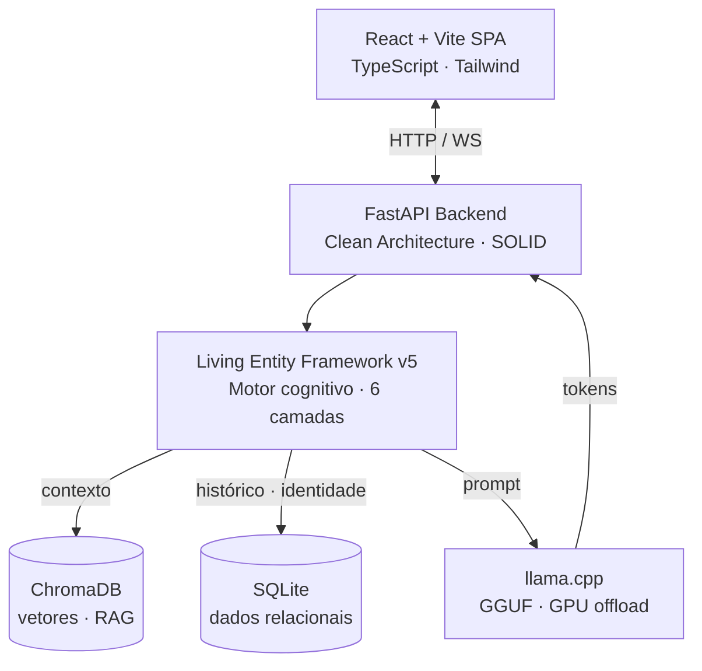

🌐 [English](README.md) · **Português (Brasil)**

# Fellype Samuel dos Santos de Melo
### Software Engineer & Tech Lead — Arquitetura de Software · IA Aplicada

  
  
  
  
  
  

  
  
  

📍 Rio de Janeiro, RJ, Brasil

---

### 🧠 Sobre Mim
Software Engineer e estudante do último período de **Análise e Desenvolvimento de Sistemas (FAETERJ-Rio)**. Atuo na intersecção entre **arquitetura de backend** e **Inteligência Artificial aplicada** (Deep Learning, NLP e Visão Computacional). Como Tech Lead, modelo requisitos de negócio em arquiteturas desacopladas e conduzo integrações técnicas de ponta a ponta.

> *"Great software starts by understanding problems before writing code."*

---

## 🤖 Projeto Principal — OpenChatBot

Motor **local-first** para agentes e personagens com **estado e memória persistente** — comportamento crível aplicável a companions, ficção interativa e **NPCs de jogos**. Execução 100% local, com RAG e controle total de privacidade, sem dependência de nuvem.

O núcleo é o **Living Entity Framework v5**, um motor cognitivo de seis camadas (master prompts, identidade, dinâmica social, estado emocional, contexto via RAG e histórico de conversa) sobre uma base **Clean Architecture / SOLID**.

*(Os detalhes de arquitetura e implementação abaixo são extraídos do próprio repositório do projeto — veja o link ao final desta seção para a fonte de verdade atual.)*

**Demo — memória persistente entre turnos** *(demonstração da interface)*

**Destaques técnicos**
- Inferência local via **llama.cpp** com quantização **GGUF** e offload de GPU.
- Memória híbrida: **SQLite** (relacional) + **ChromaDB** (vetorial / RAG).
- Separação de domínio, infraestrutura, adaptadores e apresentação (Clean Architecture).
- Deploy multiprocesso automatizado (build do frontend + serviços de IA + Uvicorn).

**Stack** &nbsp; `TypeScript` `React` `Vite` `Python` `FastAPI` `ChromaDB` `llama.cpp`

📂 **[Repositório & Documentação →](https://github.com/FellypeMelo/Open-ChatBot)**

---

## ⚡ TurboQuant — Otimização de Inferência *(fork do llama.cpp)*

Quantização de **KV-cache de 2–4 bits** com rotação **Walsh–Hadamard** (suavização de outliers antes de quantizar) para GPUs **Intel Arc / Xe2** via backend **SYCL** — o mesmo `turbo3` que alimenta o OpenChatBot.

**Benchmarks do repositório** *(Intel Arc B580 · Qwen3-4B Q4_K_M · contexto 64k):*
- 🔻 KV-cache de **9,2 GB → 1,6–1,8 GB** — até **7,5× menos** memória que fp16
- ⚡ Prefill em **paridade de velocidade com fp16**
- 🐛 6 bugs de correção resolvidos durante a implementação

**Stack** &nbsp; `C/C++` `SYCL` `Intel oneAPI` `Quantização` `llama.cpp`

📂 **[Fork & deep-dive técnico →](https://github.com/FellypeMelo/llama-cpp-turboquant-SYCL)**

---

## 🚀 Outros Projetos

| Projeto | O que resolve | Stack | Acesso |
| :--- | :--- | :--- | :--- |
| 🔬 **OpenScientific-Workbench** | Workbench agêntico para biologia computacional: pipelines multiagente em sandbox e integração de bases científicas via MCP. | `Python` · `FastAPI` · `Neo4j` · `MCP` | [Repo](https://github.com/FellypeMelo/OpenScientific-Workbench) |
| 👁️ **LocalVision-Jules** | Assistente de visão 100% local (modelos LLaVA): análise de imagem com histórico contextual e GUI acessível. | `Python` · `LM Studio` · `LLaVA` | [Repo](https://github.com/FellypeMelo/LocalVision-Jules) |
| 🧬 **Classificação de Embriões** | Rede **ResNet-18** (validação k-fold) integrada a API REST para apoiar uma **pesquisa de mestrado externa**. | `PyTorch` · `FastAPI` · `React` | FuzzyLab · privado |
| 🦠 **Segmentação de _Trypanosoma cruzi_** | Fine-tuning de **YOLOv8-seg** para segmentar estruturas em microscopia eletrônica de varredura. | `YOLOv8-seg` · `OpenCV` | FuzzyLab · privado |
| 🎓 **Educa** | Sistema de gestão escolar (turmas, notas, conteúdos) — TCC full stack, com engenharia de requisitos e modelagem relacional. | `React` · `FastAPI` · `MySQL` | Privado (TCC) |

*As linhas marcadas "privado" referem-se a repositórios não disponíveis publicamente; as descrições acima resumem meu papel no projeto, não são afirmações verificáveis de forma independente sobre os códigos-fonte privados em si.*

---

### 📝 Pesquisa & Publicação
**Primeiro autor** — periódico acadêmico revisado:

> **MELO, F. S. S.** et al. *Arquitetura Algorítmica para Atenção Sustentável: o Modelo Be-Productive como Resposta à Sobrecarga Cognitiva no Capitalismo de Vigilância*. Revista Tópicos, 2026.
> 🔗 **DOI:** [10.70773/revistatopicos/781363235](https://doi.org/10.70773/revistatopicos/781363235)

---

### 🔭 Foco Atual
- [ ] Orquestração de **multiagentes locais descentralizados** no núcleo do OpenChatBot.
- [ ] Design prático de **Sistemas Distribuídos** — Event-Driven Architecture, CQRS, Apache Kafka.
- [ ] Deploy de **visão computacional em tempo real** via WebSockets.

---

### 🛠️ Stack

**Linguagens**

  
  
  
  
  
  

**Backend & Web**

  
  
  
  

**IA & Dados**

  
  
  
  
  
  
  

**Engenharia** &nbsp; `Clean Architecture` · `SOLID` · `DDD` · `Design Patterns` · `TDD` · `XP`

---

### 🎓 Formação & Certificações
- **Análise e Desenvolvimento de Sistemas** — *FAETERJ-Rio* (último período)
- 🛡️ **Ethical Hacking & Network Defense** — Cisco Networking Academy
- 🧠 **AI Fundamentals & Artificial Intelligence** (NLP, Watson Studio) — Cisco & IBM SkillsBuild
- ☕ **Java Foundations** — Oracle Academy

---

### 📊 GitHub

  
  
  

---

  <a href="https://linkedin.com/in/fellype-samuel">LinkedIn</a> ·
  <a href="mailto:fellypesamuel1@hotmail.com">Email</a> ·
  <a href="https://orcid.org/0009-0000-3274-0343">ORCID</a> ·
  <a href="https://github.com/FellypeMelo">GitHub</a>

<i>Aberto a colaborar em engenharia de software, IA aplicada e projetos open source.</i>

