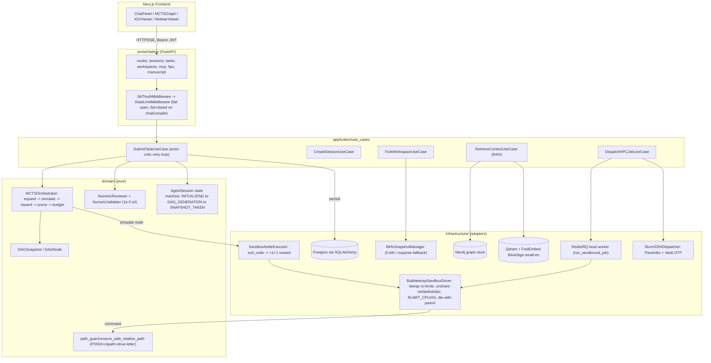
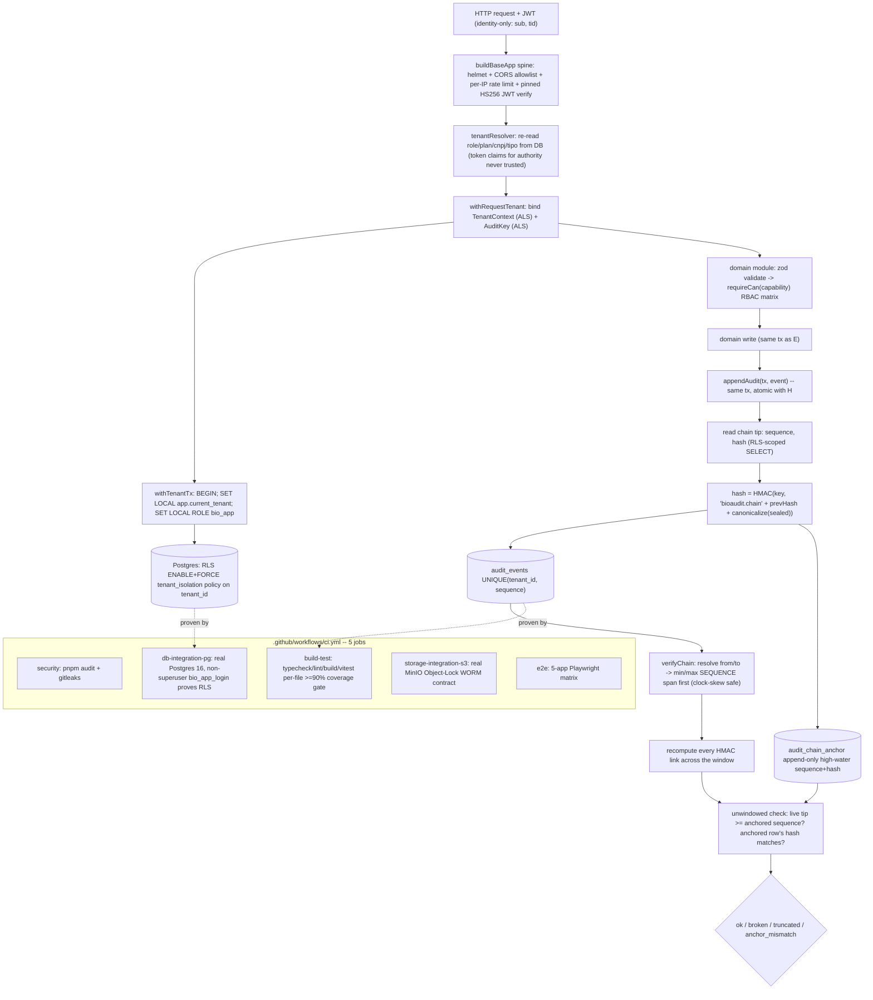
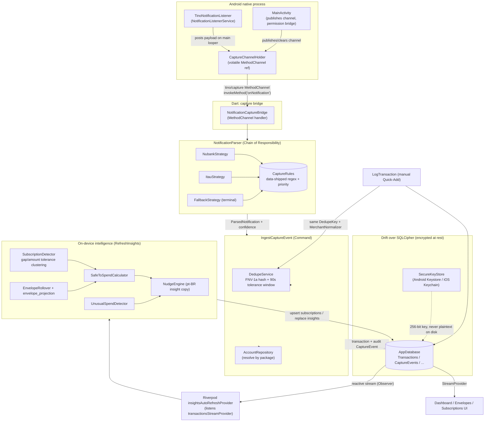
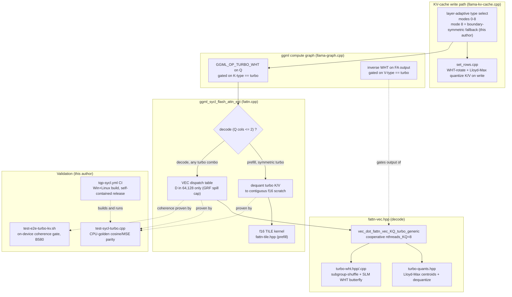

🌐 [English](README.md) · **Português (Brasil)**

# Fellype Samuel dos Santos de Melo
### Software Engineer & Tech Lead — Arquitetura de Software · IA Aplicada

  
  
  
  
  
  

  
  
  

📍 Rio de Janeiro, RJ, Brasil

---

### 🧠 Sobre Mim
Software Engineer e estudante do último período de **Análise e Desenvolvimento de Sistemas (FAETERJ-Rio)**. Atuo na intersecção entre **arquitetura de backend** e **Inteligência Artificial aplicada** (Deep Learning, NLP e inferência em GPU), normalmente sozinho, de ponta a ponta: modelagem de domínio, infraestrutura e a esteira de CI que valida as duas coisas.

> *"Great software starts by understanding problems before writing code."*

---

## 🗂️ Projetos Selecionados

Nove repositórios passaram por uma revisão técnica real antes de esta seção ser escrita — arquitetura, suítes de teste, histórico de commits, arquivos de benchmark. Seis estão detalhados abaixo, ordenados por profundidade técnica, não por visibilidade: os dois mais substanciais, **OpenScientific-Workbench** e **bio-saas**, são um público e um privado. Quatro projetos privados aparecem aqui porque a engenharia é o que importa e o código me pertence; cada seção privada cobre apenas arquitetura, algoritmos e estratégia de testes — nunca credenciais, schemas, dados de clientes/pacientes ou termos comerciais. Mais três projetos que não precisaram de uma seção completa estão resumidos em uma tabela mais abaixo.

---

### 🔬 OpenScientific-Workbench — público

**Uma plataforma de agente de pesquisa em Clean Architecture onde código de bioinformática gerado por LLM realmente executa, dentro de um sandbox real de sistema operacional, controlado por um agendador em DAG e um laço de revisão numérica.**

Deixar um LLM planejar um fluxo de trabalho de bioinformática em várias etapas e depois executar o código que ele mesmo escreveu tem dois modos de falha que ficam invisíveis em uma demonstração: o Python/R/bash gerado precisa ser contido para não ler o sistema de arquivos do host nem acessar a rede, e o agente precisa ser impedido de devolver, com confiança, um número errado. Os dois só aparecem depois — como um CVE ou um resultado retratado.

**Como foi resolvido.** A execução não confiável é isolada com **bubblewrap (bwrap)**, não com um runtime de contêiner: o `BubblewrapSandboxDriver` monta um argv fixo que monta somente-leitura `/usr /bin /sbin /lib /lib64 /etc` mais um toolkit micromamba dedicado, mantido fora do venv/PATH da própria aplicação, monta leitura-e-escrita apenas o workspace daquela sessão, isola um tmpfs próprio e adiciona `--unshare-net --unshare-pid --unshare-uts --unshare-ipc --die-with-parent`; limites de tempo de CPU e de espaço de endereçamento são aplicados via `RLIMIT_CPU`/`RLIMIT_AS` em um `preexec_fn` antes do exec. Todo outro adaptador da base de código (Neo4j, Vault, Slurm) recorre a um mock quando não configurado — este é o único driver que se recusa deliberadamente a isso: ele levanta `SandboxUnavailableError` e não executa código sem sandbox se o bwrap estiver ausente. Uma versão anterior do guard contra path traversal só verificava `..` e uma barra inicial estilo POSIX, deixando passar caminhos absolutos com letra de unidade do Windows como `C:\Windows` — reproduzido na própria máquina Windows onde o projeto é desenvolvido (documentado no módulo como correção de CWE-22). Hoje ele verifica `posixpath.isabs`, `ntpath.isabs` e uma regex de letra de unidade em conjunto. Sobre a execução fica um orquestrador que percorre a frente topológica de um DAG, mapeia o código de saída real de cada nó para uma recompensa +1/−1, poda nós reprovados e propaga a poda para todos os dependentes, parando quando o orçamento de tokens se esgota — um agendador guloso de passagem única, não uma busca em árvore completa, apesar do nome da classe. Como um código de saída não pega um script que roda limpo mas devolve um número sutilmente errado, um segundo portão independente entra em cena: um `NumericReviewer` compara estruturas aninhadas de float/dict/list com tolerância de `1e-5`, e uma execução reprovada tenta de novo (com limite) antes de uma aprovada ser hasheada contra o lockfile do próprio backend para reprodutibilidade.

**Também resolvido:**
- **172 ferramentas científicas registradas, classificadas com honestidade.** Em vez de apresentar todas as ferramentas como igualmente confiáveis, cada uma recebe uma nota de A (chamada determinística de biblioteca) a D (registrada mas que sempre levanta `NotSupportedError` — depende de infraestrutura que este deployment de servidor único não tem), documentado em `docs/tools/UNSUPPORTED.md`.
- **Jobs locais e de HPC passam pelo mesmo caminho sandboxed.** O `LocalJobDispatcher` (Redis/RQ) e o `SlurmSSHDispatcher` (Paramiko + `sbatch`) direcionam o script compilado pelo mesmo `BubblewrapSandboxDriver`, de forma que trocar de backend nunca abre um segundo caminho de execução sem sandbox.

**Resultados.** 92 commits de um único autor ao longo de aproximadamente três semanas (01/07/2026 a 23/07/2026); 134 arquivos de código no backend / 24.747 linhas contra 105 arquivos de teste / 19.504 linhas (razão teste:código de ~0,79); a CI aplica um portão de cobertura de 80% mais um job dedicado que instala bubblewrap real em `ubuntu-latest` para rodar payloads reais de tentativa de escape — os próprios comentários da CI marcam essas asserções específicas como ainda não confirmadas fora da máquina Windows onde o projeto é escrito, pendente de um runner Linux real.

**Stack** &nbsp; `Python 3.12` `FastAPI` `SQLAlchemy (async)` `bubblewrap` `Redis/RQ` `Qdrant + FastEmbed` `Neo4j` `Paramiko + Vault` `Next.js/React` `igv.js` `Mol*` `pytest` `ruff` `mypy`

📂 **[Repositório →](https://github.com/FellypeMelo/OpenScientific-Workbench)**

---

### 🏥 bio-saas — privado

**Repositório privado.** A descrição abaixo cobre apenas arquitetura, algoritmos e estratégia de testes — nunca schemas, segredos, dados de clientes ou termos comerciais.

**Um monorepo pnpm com 5 micro-SaaS de conformidade para saúde/estética no Brasil, compartilhando uma espinha dorsal de pacotes reforçada, cuja trilha de auditoria é comprovadamente à prova de adulteração contra um atacante privilegiado — um DBA, ou alguém que restaura um dump de banco de dados e edita linhas diretamente.**

Clínicas de saúde e estética no Brasil enfrentam vários prazos regulatórios que exigem, no fundo, a mesma garantia técnica: um registro auditável que sobreviva não só a um atacante externo, mas a um interno. Uma cadeia de hash simples não resolve isso — um DBA capaz de reescrever linhas também consegue recalcular uma cadeia sobre as linhas editadas — e mesmo uma cadeia de hash *correta*, reproduzida sobre um prefixo mais curto, ainda verifica normalmente, escondendo uma cauda apagada.

**Como foi resolvido.** Cada evento de auditoria é selado e encadeado com `hash = HMAC-SHA256(serverKey, 'bioaudit.chain\0' + prevHash + '\0' + canonicalize(event))` — um vínculo com chave que um atacante que edita linhas não consegue forjar sem o segredo mantido no servidor, ao contrário de uma cadeia SHA-256 simples. Uma restrição `UNIQUE(tenant_id, sequence)` torna a cadeia comprovadamente infurcável sob concorrência. Como uma cadeia HMAC válida sobre um prefixo *mais curto* ainda verifica normalmente, uma segunda tabela independente e somente-inserção (`audit_chain_anchor`) registra, na mesma transação de cada inserção, a sequência de maior valor e o hash da ponta da cadeia; a verificação compara a ponta atual contra essa âncora para detectar truncamento. A verificação também resolve qualquer consulta por intervalo de datas para um intervalo de *sequência* antes de selecionar as linhas — sequência é monotônica e sem lacunas, o relógio de parede não é — de forma que uma janela baseada em timestamp não relate uma quebra falsa por causa de deriva de relógio. O isolamento entre clientes (tenants) é uma segunda camada, independente: um wrapper de transação abre com `SET LOCAL app.current_tenant` + `SET LOCAL ROLE bio_app`, e o Row-Level Security do Postgres (`ENABLE + FORCE`) restringe toda consulta ao tenant atual no nível do banco de dados, não apenas no código da aplicação. O banco rápido usado em desenvolvimento/teste (Postgres compilado para WASM, em processo) conecta como superusuário e por isso não consegue exercitar nem desmentir o RLS — então um job dedicado de CI sobe um Postgres 16 real, autentica como um papel de login genuinamente não-superusuário, e verifica ali, onde a garantia realmente pode falhar, que leituras entre tenants são negadas e inserções com tenant forjado são rejeitadas.

**Também resolvido:**
- **SSRF em uma URL de webhook fornecida pelo tenant**, incluindo a janela de TOCTOU de DNS rebinding entre validação e conexão — fechada com um classificador de faixas IPv4/IPv6 sem dependências (loopback, RFC1918, CGNAT, ULA, link-local, o endereço de metadados de nuvem) aplicado tanto no momento de gravar a configuração quanto no momento real da conexão, via um hook customizado de resolução DNS que revalida o endereço que o socket está prestes a usar.
- **Rotação de refresh token sob requisições concorrentes**, incluindo detecção de reuso de token roubado — um lock de linha no id do token serializa tentativas concorrentes, uma atualização condicional de uso único cujo número de linhas afetadas é a única autoridade sobre se o token já foi consumido, e um reuso detectado revoga todos os outros tokens ativos daquele usuário na mesma transação.

**Resultados.** Rodar a suíte de testes diretamente reproduz 22 dos 23 arquivos de teste, com 265 de 277 testes passando localmente e 12 pulados — exatamente os testes de Postgres real e S3 real, que dependem de infraestrutura viva não presente localmente. A CI roda esses dois arquivos de verdade, contra um Postgres 16 e um contêiner de serviço MinIO reais, como parte de um pipeline de 5 jobs: varredura de dependências/segredos, um portão de cobertura ≥90% por arquivo em typecheck/lint/build/test, a prova de RLS em Postgres real, a prova de WORM em S3 real, e uma matriz de Playwright cobrindo os 5 apps.

**Stack** &nbsp; `TypeScript (strict)` `Node 22 / ESM` `Fastify 5` `Drizzle ORM` `PostgreSQL 16 (RLS)` `argon2` `AWS S3 Object-Lock / MinIO` `zod` `React (PWA)` `Vitest` `Playwright` `pnpm workspaces`

---

### 📱 tino — privado

**Repositório privado.** A descrição abaixo cobre apenas arquitetura, algoritmos e estratégia de testes — nunca roadmap de produto, conteúdo real de notificações ou dados pessoais.

**Um app financeiro Flutter local-first que lê notificações de banco/Pix diretamente do celular e as transforma em transações estruturadas no próprio dispositivo — sem login bancário, sem servidor.**

Apps de finanças pessoais no Brasil ou exigem sincronização frágil via login bancário, ou forçam entrada manual que as pessoas abandonam. A abordagem do Tino exige uma etapa de extração genuinamente difícil — o texto das notificações de banco varia por instituição, muda sem aviso e carrega uma formatação numérica ambígua em português brasileiro — ao mesmo tempo em que precisa garantir que nenhuma compra seja contada duas vezes entre dois caminhos de entrada independentes (captura silenciosa e lançamento manual rápido), e depois derivar inteligência de orçamento/assinaturas a partir desse próprio ledger auto-reportado, sem nada externo para conferir.

**Como foi resolvido.** Um `NotificationListenerService` nativo em Kotlin observa notificações postadas em todo o sistema (uma vez que o usuário concede o consentimento do sistema operacional) e encaminha título, corpo e horário de postagem ao Dart via um method channel. Do lado Dart, uma **Chain of Responsibility** de estratégias por instituição (indexadas pelo nome do pacote) delega a extração de campos a objetos `CaptureRule` — padrões de regex entregues como *dados*, com uma prioridade, não compilados no app, de forma que um novo template de banco ou uma correção sobe sem precisar de novo release. Cada regra atribui uma confiança (1,0 para correspondência completa, 0,7 apenas para o valor, −0,2 para ambiguidade de múltiplos valores), e uma pequena função `parseBrAmount()` desambigua `1.234,56` vs `12.34` vs `1.234` usando as convenções de agrupamento do português brasileiro. Um caso de uso `IngestCaptureEvent` resolve a conta de destino, calcula um hash de deduplicação FNV-1a de 64 bits sobre conta + valor + nome do estabelecimento normalizado + horário truncado ao minuto, adiciona uma janela de tolerância de 90 segundos para duplicatas próximas do limite, e grava em um banco criptografado com SQLCipher cuja chave vive apenas no Android Keystore / iOS Keychain. Uma camada separada de inteligência, totalmente local ao dispositivo, roda de novo a cada mutação do ledger: a detecção de assinaturas agrupa débitos por estabelecimento usando faixas de tolerância de intervalo/valor, e um calculador de "livre para gastar" e um sistema de envelopes derivam um orçamento diário transparente a partir de aritmética sobre as próprias transações — sem fonte de dados externa, sem caixa-preta.

**Dois bugs enviados, encontrados e corrigidos de propósito:**
- Captura Silenciosa e o Lançamento Manual normalizavam nomes de estabelecimento de formas diferentes, então um mesmo estabelecimento real se dividia em dois grupos de assinatura, e um lançamento manual de uma compra já capturada era contado duas vezes. Corrigido extraindo um único normalizador compartilhado pelos dois caminhos, verificando um hash de deduplicação existente antes de inserir, e ligando a verificação de janela de tolerância — que existia no código mas nunca era chamada — ao caminho de ingestão, fechando um caso real de fronteira entre 12:00:59 e 12:01:03 que um bucket de hash exato sozinho deixaria passar.
- A detecção de assinaturas originalmente gerava um id aleatório novo a cada recomputação, então rodá-la de novo (o que acontece a cada mutação do ledger) empilhava linhas duplicadas sem limite. Corrigido com um id determinístico derivado do estabelecimento, um índice único, e uma migração de schema real que limpa linhas duplicadas legadas antes que o índice possa ser criado — verificado construindo à mão um banco SQLite legado bruto e checando que o ledger sobrevive intacto ao upgrade.

**Resultados.** 33 arquivos de teste, 180 casos `test()` mais 7 testes de widget (187 no total, contados diretamente na árvore de testes) — nenhum percentual de cobertura é reivindicado aqui, já que a CI publica um artefato de cobertura mas não usa um limiar como portão. Os dois defeitos corrigidos acima têm cada um seu próprio teste de regressão nomeado, não foram apenas corrigidos silenciosamente. A CI verifica atualização do código gerado, formatação, análise estática e a suíte de testes completa antes de qualquer merge.

**Stack** &nbsp; `Flutter/Dart` `Kotlin (listener nativo)` `Riverpod` `Drift + SQLCipher` `flutter_secure_storage` `fpdart` `GitHub Actions`

---

### 📒 fecho — privado

**Repositório privado.** A descrição abaixo cobre apenas arquitetura, algoritmos e estratégia de testes. A própria revisão deste projeto não encontrou números de benchmark, cobertura ou contagem de testes adequados para citar aqui — então, diferente das outras seções, nenhum número aparece abaixo; a engenharia é descrita em seus próprios termos.

**Um livro-caixa Flutter local-first para microempreendedores (MEI) brasileiros que transforma o fechamento diário de 60 segundos em um lançamento contábil real de partidas dobradas.**

O ritual diário — o que vendeu, o que não vendeu, a contagem do caixa — precisa virar um livro contábil que um contador brasileiro realmente aceitaria: precisa bater exatamente R$0,00 sempre, nunca pode duplicar a receita de um dia se o app morrer no meio da escrita, e precisa aplicar tratamento tributário diferente dependendo se o negócio é MEI (imposto mensal fixo, teto rígido de faturamento anual) ou Simples Nacional ME (tributação percentual) — tudo isso totalmente offline e criptografado em repouso.

**Como foi resolvido.** Dinheiro é um value object que envolve um tipo decimal de precisão arbitrária — ponto flutuante é explicitamente rejeitado no próprio comentário da classe, porque um livro contábil "precisa fechar em exatamente zero". O lançamento de cada fechamento diário é um **Strategy**: uma factory escolhe entre um poster MEI ou um poster Simples-ME, ambos estendendo uma classe base que emite os lançamentos compartilhados (vendas por forma de pagamento, movimentações de caixa, baixas por perda) e delegando a um hook de template-method para linhas específicas de regime — apenas o poster Simples o sobrescreve, para lançar o imposto acumulado na alíquota efetiva resolvida. Todo lote então passa por um validador de balanço que não verifica apenas se o total de débitos é igual ao total de créditos (um bug simétrico poderia satisfazer isso enquanto ainda credita a conta errada) — ele monta um mapa completo de balanço por conta ao longo do lote inteiro e exige que a movimentação líquida de *cada* conta seja exatamente zero, sem margem de erro. A escrita inteira — linhas de venda, movimentações de caixa, lançamentos contábeis e o cabeçalho do fechamento, em quatro tabelas separadas — passa por uma Unit of Work: uma falha de estilo funcional dentro do callback da transação é convertida em uma exceção lançada para que o próprio rollback de transação do banco desfaça a escrita parcial, depois traduzida de volta ao contrato normal do código de "falhas são valores, não exceções" na saída. Se o keystore da plataforma algum dia invalidar a chave de criptografia armazenada (por exemplo, depois de um reset biométrico/de segurança), o app trata o banco de dados agora permanentemente indecifrável como irrecuperável, apaga-o e gera uma chave nova — trocando perda de dados por um app que continua funcionando, em vez de travar em loop na inicialização.

**Também resolvido:**
- **Seis migrações de schema sem nunca arriscar travar sobre dados reais de usuário.** Uma migração adicionou uma restrição de unicidade para tornar o fechamento duplicado de um dia estruturalmente impossível no nível do SQL — o que exigiu primeiro deduplicar quaisquer fechamentos duplicados pré-existentes (e seus lançamentos contábeis dependentes), ou a própria migração falharia contra a restrição que estava adicionando. Isso é verificado partindo de um snapshot de schema legado gerado, inserindo dois fechamentos duplicados via SQL bruto, migrando para frente, e verificando que exatamente o mais recente sobrevive.
- **Proporcionalizar corretamente o teto de faturamento anual** para um negócio registrado no meio do ano, ao mesmo tempo em que limita a projeção de esgotamento por taxa de consumo, para que um dia de faturamento quase zero não produza uma projeção de décadas em vez de um "sem projeção" sensato.

**Stack** &nbsp; `Flutter/Dart` `Drift` `SQLCipher` `flutter_secure_storage` `package:decimal` `fpdart` `freezed` `Riverpod` `GitHub Actions`

---

### ⚡ llama-cpp-turboquant-SYCL — fork público, não integrado ao upstream

**Um port de um esquema existente de compressão de KV-cache para o backend SYCL da Intel em GPUs Arc — não a invenção do esquema em si.**

Este é um fork do [`TheTom/llama-cpp-turboquant`](https://github.com/TheTom/llama-cpp-turboquant), que por sua vez é um fork do [`ggml-org/llama.cpp`](https://github.com/ggml-org/llama.cpp) (10.185 commits no ponto de origem). O **TurboQuant** — uma rotação de Walsh-Hadamard seguida de quantização por codebook de Lloyd-Max no KV-cache, inventado e implementado para Metal e CUDA por TheTom e Gabe Ortiz, com contribuições de Sean, Tuklus-Labs, Simon Gardling e Nathan Maine — não é trabalho meu. O que eu escrevi, verificado diretamente com `git log --author` sobre este fork, são aproximadamente 30 commits: o port desse esquema para o backend SYCL da Intel, os kernels de rotação para esse backend, um despachante de flash-attention de precisão assimétrica, e o teste de paridade e a esteira de CI que validaram o port em hardware físico. Não existe pull request nem merge upstream no `ggml-org/llama.cpp` — isto é um artefato de release pessoal, não uma contribuição aceita.

**O problema que o port precisou resolver.** Em uma Intel Arc B580 de 12GB, o KV-cache — não os pesos do modelo — é o limite de memória para inferência de contexto longo (o KV em fp16 a 64k de contexto chega perto de 9,2GB, quase estourando a memória). O TurboQuant já comprimia isso para 2–4 bits/valor em CUDA e Metal, mas nada disso se transfere para SYCL: a GPU da Intel tem um modelo de subgroup/registradores diferente dos warps do CUDA, uma implementação de flash-attention diferente para se conectar, e cada afirmação numérica precisou ser reprovada do zero em silício Arc real.

**Como o port foi feito.** O kernel de rotação faz seus estágios de borboleta via shuffles de subgroup (`sycl::select_from_group`) enquanto o tamanho do passo é menor que o subgroup do hardware, e então muda para uma borboleta sincronizada por barreira em memória local compartilhada assim que o passo cruza esse limite — um kernel de dois regimes sem equivalente direto em CUDA, já que subgroups do SYCL e warps do CUDA não se alinham um a um. O despacho de flash-attention é uma grade de macros que instancia um kernel orientado a decodificação ou a prefill por combinação de (dimensão de cabeça, tipo de K, tipo de V); as linhas turbo ficam limitadas a dimensão de cabeça 64/128 porque o modo de arquivo de registradores grande da Intel tem um teto de cerca de 128 registradores/thread contra os 255 do CUDA — o vetor de consulta pré-rotacionado completo estoura em 256. O estado de rotação é conduzido através do grafo de computação como operações "gated" (a consulta é rotacionada na entrada, a saída é rotacionada inversamente, ambas condicionadas ao tipo de dado do cache) em vez de reaplicado no laço quente — e é isso que permite que um par assimétrico chave-precisa/valor-comprimido funcione sem nenhuma mudança no grafo.

**Uma história de depuração que vale por si só.** Um commit reescreveu o kernel de decodificação para um padrão cooperativo de fatiamento na hipótese de que um limite de ocupação de registradores estava causando uma lentidão observada de 3,4x na decodificação em profundidade — e então mediu que um cache quantizado padrão de 8 bits colapsa numa proporção comparável na mesma profundidade (o cache comprimido, na verdade, se sai um pouco melhor). Isso derrubou a hipótese: a regressão se mostrou inerente à desquantização por elemento em qualquer laço de decodificação de KV quantizado, não um defeito específico deste esquema. A refatoração foi mantida como uma melhoria de folga de registradores, não apresentada como a correção de algo que ela não corrigiu. Um bug relacionado era uma política pré-existente adaptativa por camada que colocava duas camadas de fronteira numa combinação para a qual a tabela de despacho não tinha caso definido, produzindo uma falha no aquecimento do modelo; a correção que se seguiu produziu saída instável e não-determinística em precisão de 2 bits nessas mesmas camadas de fronteira, com causa raiz identificada como redução de ponto flutuante sem folga de quantização, e finalmente resolvida com um modo de fallback simétrico, de forma que camadas de fronteira só exercitam os dois caminhos já comprovados independentemente.

**Validação, deliberadamente em três camadas independentes**, porque paridade no nível do kernel e coerência no nível do modelo são modos de falha diferentes: um teste de paridade numérica com referência de CPU, comparando contra os próprios quantizadores de referência dos autores do CUDA/Metal (similaridade de cosseno e MSE), um portão de coerência em dispositivo real que roda geração de texto de verdade na GPU física e rejeita incompatibilidade de palavras-chave, corrupção, repetição de 5-gramas ou baixa diversidade lexical, e um portão de qualidade de perplexidade/velocidade. Uma versão anterior da suíte de testes só verificava se "a saída é finita" — o que havia escondido bugs reais (rotação dupla, um valor mal lido no cache).

**Resultados, todos vindos dos próprios arquivos de benchmark do repositório.** Os formatos comprimidos rodam a 2,125 / 3,125 / 4,25 bits/valor contra os 16 do fp16 — 7,53x / 5,12x / 3,76x menores. Numa Arc B580 com um modelo Qwen3-4B, habilitar uma configuração de build moveu o prefill de 1246,70 para 2528,80 tok/s (+102,8%) com a decodificação dentro da margem de erro da base (−3,3%); a geração real de ponta a ponta com o cache comprimido rodou a 74,8 tok/s contra uma base fp16 de 77,4 tok/s (−3,4%) e produziu texto coerente, enquanto a mesma configuração sem a correção de camada de fronteira degenerava em repetições em loop. Uma regressão documentada e não escondida: a decodificação do cache comprimido é cerca de 3,4x mais lenta que fp16 em profundidade de contexto de 32k — mas a quantização padrão de 8 bits colapsa numa proporção comparável na mesma profundidade, então a comparação que importa é contra outros caches quantizados, não contra fp16.

**Stack** &nbsp; `C++` `SYCL / DPC++ (Intel oneAPI)` `CMake + Ninja` `grafo de computação ggml/llama.cpp` `Intel Arc B580 (Xe2)` `GitHub Actions (CI Windows + Linux)`

📂 **[Fork →](https://github.com/FellypeMelo/llama-cpp-turboquant-SYCL)**

---

### 🤖 Open-ChatBot — público

**Um motor de personagens de roleplay via LLM, local-first e auto-hospedado: um montador de prompt com orçamento de tokens, uma máquina de estados de persona com controle de concorrência otimista, e um armazenamento de memória quantizado à prova de falhas.**

Rodando sobre um modelo local pequeno com uma janela de contexto estreita que presta pouca atenção ao seu próprio meio, a concatenação ingênua do histórico de conversa ou estoura a janela ou afoga a persona do personagem em ruído. Além disso, um personagem pode manter vários ramos de conversa concorrentes — edições, regenerações, um processo de reflexão em segundo plano — então uma persona compartilhada e mutável precisa se manter consistente entre escritores concorrentes, enquanto a memória de cada ramo permanece isolada de seus irmãos. Um bug histórico neste mesmo repositório, reproduzido por um teste de regressão nomeado, mostra o modo de falha concretamente: recuperação de memória sem limiar, combinada com um caminho de limpeza de conversa que nunca tocava o armazenamento vetorial, deixava conteúdo alucinado reaparecer turnos depois.

**Como foi resolvido.** A montagem do prompt tem orçamento calculado contra o tokenizador *real* do modelo — um calculador consulta o endpoint de tokenização do servidor de inferência local para contagens exatas, mantém uma tabela de alocação de teto fixo por camada de prompt sincronizada com o que o template de fato produz, estabelece um piso mínimo de histórico de conversa para que nunca chegue a zero, e roda uma checagem final não-bloqueante sobre o prompt já montado como um registro de último recurso em caso de estouro. A pilha montada repete um resumo compacto de persona e cena logo antes da deixa de geração, explorando deliberadamente o viés de atenção de um modelo pequeno para o início e o fim do seu contexto. O estado de persona usa a coluna de versão para bloqueio otimista do SQLAlchemy, obtida sob um lock de linha e envolvida em laços de repetição limitados em todo caminho de escrita; cada repetição rederiva o estado atual e reaplica manualmente qualquer mutação de domínio que o rollback tenha descartado, já que um simples re-commit a perderia silenciosamente. Uma restrição de unicidade no nível do banco de dados, sobre ramo/variante de mensagem, cobre a mesma corrida para inserções concorrentes de regeneração/streaming. A persona persistente espelha qual conversa está ativa no momento para os campos específicos daquela conversa — a própria documentação interna do código chama isso da área mais propensa a bugs do sistema — e uma tarefa de reflexão em segundo plano é ciente desse espelhamento, de forma que uma chamada assíncrona lenta não vaze o delta de relacionamento de uma história para outra, caso o usuário troque de conversa no meio da reflexão. A memória de longo prazo é um armazenamento vetorial quantizado em 4 bits (a mesma família TurboQuant do fork SYCL acima), isolado por personagem-e-conversa em toda leitura e escrita; a recuperação busca mais resultados do que precisa, descarta os abaixo de um piso de similaridade, reordena por similaridade combinada com recência, e descarta greedily resultados quase duplicados para que paráfrases não ocupem os melhores lugares. A persistência usa um dump atômico customizado — o formato multi-arquivo do armazenamento é escrito primeiro em um diretório temporário irmão, depois cada arquivo é promovido com uma renomeação atômica, eliminando escritas parciais em caso de falha.

**Resultados.** 236 commits de um único autor ao longo de aproximadamente 2,5 meses (07/05/2026 a 25/07/2026); 45 arquivos de teste no backend, 10.117 linhas, 304 funções de teste, incluindo suítes de regressão dedicadas contra "envenenamento" de memória e vazamento entre conversas; a CI aplica um portão de cobertura de 80% tanto em runners Linux quanto Windows — a perna Windows existe especificamente porque um bug anterior, específico do Windows, havia passado despercebido por uma matriz só-Linux, segundo o próprio comentário da esteira.

**Demo — memória persistente entre turnos** *(demonstração da interface)*

**Stack** &nbsp; `FastAPI` `SQLAlchemy + Alembic + SQLite` `httpx` `LangChain (cliente compatível com OpenAI)` `llama.cpp / llama-server` (rodando sua própria quantização de KV-cache `turbo3` a partir do fork SYCL acima) `armazenamento vetorial quantizado em 4 bits` `React 19 + TypeScript + Vite` `Vitest + Playwright`

📂 **[Repositório →](https://github.com/FellypeMelo/Open-ChatBot)**

---

## 🚀 Mais Projetos

Mais três projetos passaram pela mesma revisão e se sustentaram bem, sem precisar de uma seção completa aqui.

| Projeto | O que é | Mecanismo-chave | Stack | Acesso |
| :--- | :--- | :--- | :--- | :--- |
| **StoryForge** | App desktop offline-first para escrita de romances assistida por IA | Busca semântica `sqlite-vec` sobre o "codex" da história que sobrevive a mudanças de dimensão de embedding em tempo real; um roteador de 6 provedores de LLM protegido por circuit breaker; validado contra um servidor `llama.cpp` real (não mockado), que pegou uma variação real de saída do modelo que um dublê de teste vinha escondendo | Rust/Tauri, React/TS, SQLite + sqlite-vec, llama.cpp | [Repo](https://github.com/FellypeMelo/StoryForge) |
| **embryo_trainer** | Pipeline PyTorch/YOLO refatorado em DDD para classificação de embriões e graduação de blastocisto em FIV | Diagnosticou um bug de vazamento de dados por grupo na validação cruzada — a acurácia caiu de um vazado 94–97% para um honesto 91,37% em holdout, depois de agrupar os folds por identidade do embrião em vez de por frame; a exportação ONNX INT8 exclui a cabeça de detecção depois que a quantização completa zerou a acurácia por inteiro | PyTorch, Ultralytics YOLO, ONNX Runtime, scikit-learn | Privado — apenas abordagem técnica |
| **SilenceArc** | App de supressão de ruído em tempo real para GPUs Intel Arc | Conecta manualmente todo o forward pass de 133 tensores do DeepFilterNet3 a descritores de primitivas oneDNN brutos sobre uma única fila SYCL, sem OpenVINO/ONNX Runtime no caminho de GPU; latência medida de 2,4–3,9ms por frame (p99 de 4,3–4,9ms) contra um orçamento de 10ms | C++20, SYCL/oneDNN, oneMKL, fallback em Rust vendorizado | [Repo](https://github.com/FellypeMelo/SilenceArc) |

*A linha privada acima descreve apenas a abordagem técnica, seguindo a mesma nota de confidencialidade das seções anteriores.*

---

### 📝 Pesquisa & Publicação
**Primeiro autor** — periódico acadêmico revisado:

> **MELO, F. S. S.** et al. *Arquitetura Algorítmica para Atenção Sustentável: o Modelo Be-Productive como Resposta à Sobrecarga Cognitiva no Capitalismo de Vigilância*. Revista Tópicos, 2026.
> 🔗 **DOI:** [10.70773/revistatopicos/781363235](https://doi.org/10.70773/revistatopicos/781363235)

---

### 🔭 Foco Atual
- [ ] Orquestração agêntica para computação científica — agendamento em DAG, execução em sandbox, laços de revisão de correção numérica (OpenScientific-Workbench).
- [ ] Programação de kernels de GPU de baixo nível para Intel Arc / SYCL — quantização de KV-cache, inferência de DSP em tempo real (llama-cpp-turboquant-SYCL, SilenceArc).
- [ ] Arquitetura de backend em nível de conformidade para domínios regulados — isolamento de tenants, trilhas de auditoria à prova de adulteração (bio-saas).

---

### 🛠️ Stack

**Linguagens**

  
  
  
  
  
  
  
  
  

**Backend & Dados**

  
  
  
  
  
  
  
  

**IA & Dados**

  
  
  
  
  
  

**Sistemas & GPU**

  
  

**Engenharia** &nbsp; `Clean Architecture` · `SOLID` · `DDD` · `Design Patterns` · `TDD` · `XP`

---

### 🎓 Formação & Certificações
- **Análise e Desenvolvimento de Sistemas** — *FAETERJ-Rio* (último período)
- 🛡️ **Ethical Hacking & Network Defense** — Cisco Networking Academy
- 🧠 **AI Fundamentals & Artificial Intelligence** (NLP, Watson Studio) — Cisco & IBM SkillsBuild
- ☕ **Java Foundations** — Oracle Academy

---

### 📊 GitHub

  
  
  

---

  <a href="https://linkedin.com/in/fellype-samuel">LinkedIn</a> ·
  <a href="mailto:fellypesamuel1@hotmail.com">Email</a> ·
  <a href="https://orcid.org/0009-0000-3274-0343">ORCID</a> ·
  <a href="https://github.com/FellypeMelo">GitHub</a>

<i>Aberto a colaborar em engenharia de software, IA aplicada e projetos open source.</i>

